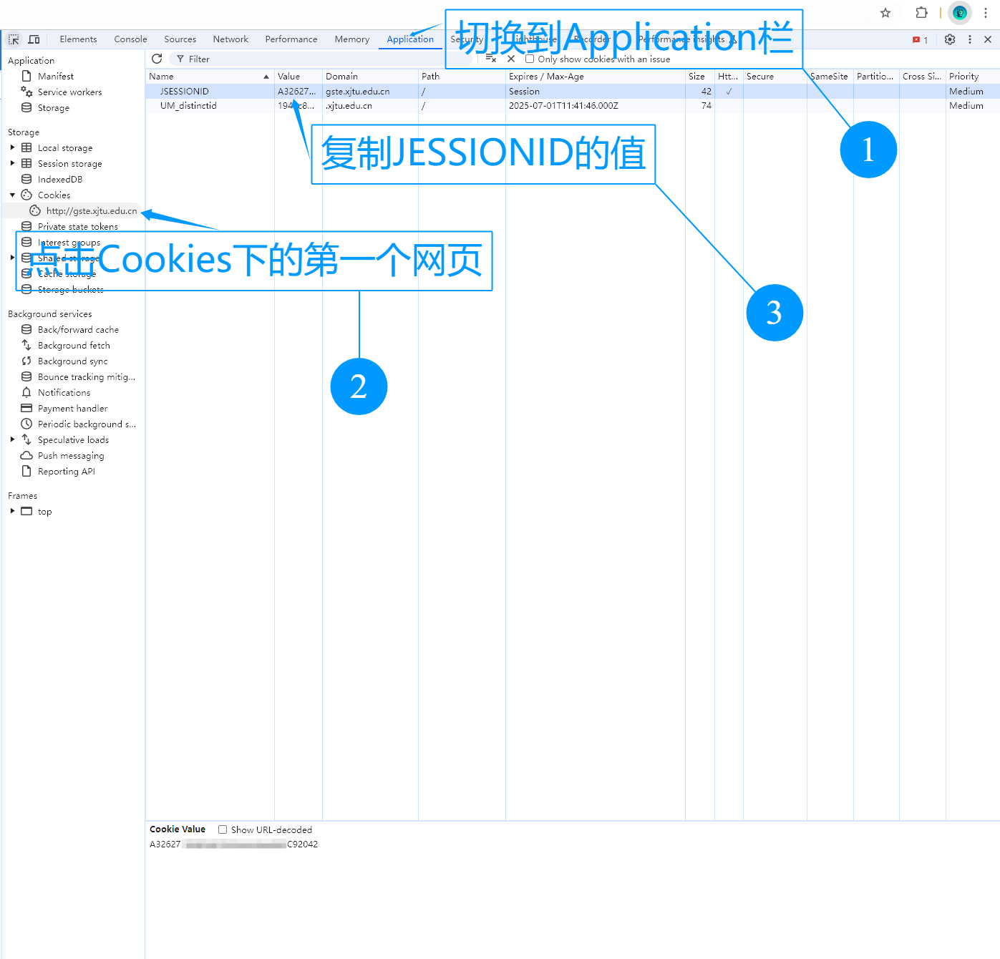
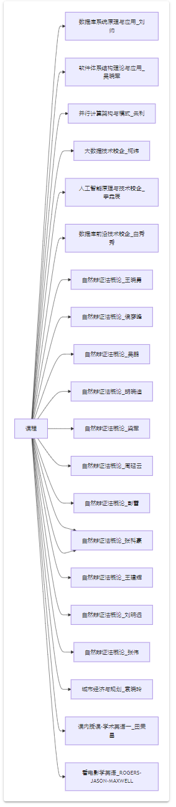
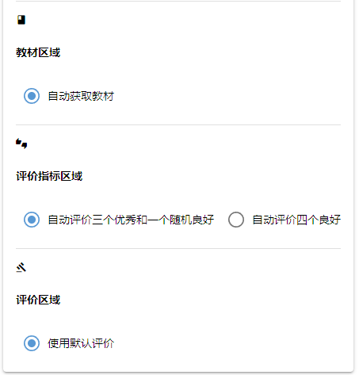

### XJTU-GS-Teaching-Evalutation
研究生自动评教系统

## 项目简介
> 项目的格式来源于 [wangerforcs](https://github.com/wangerforcs)。

本项目是一个自动评教系统，通过爬虫实现，可以一键完成评教

评教系统中可以多次提交，不必担心提交后不能修改

> ❗本项目功能已实现90%，欢迎提出PR改进

## 使用方法

### 安装依赖
```shell
pip install nicegui beautifulsoup4
```

### 运行项目
```shell
python app.py
```

### 获取研究生评教系统Cookie(Cookie1)
首先，登录 [研究生评教系统](http://gste.xjtu.edu.cn/) ( http://gste.xjtu.edu.cn/ )，然后按`F12`打开开发者工具，并按如下操作复制cookie



将复制的cookie输入项目中的Cookie1栏中

### 获取研究生管理信息系统Cookie(Cookie2)
登录 [研究生管理信息系统](http://gmis.xjtu.edu.cn/pyxx/) ( http://gmis.xjtu.edu.cn/pyxx/ )，并按相同的方法获取cookie，输入项目中的Cookie2栏中
这步获取Cookie2的原因是：获取课程信息的操作需要在研究生管理信息系统中进行，评教系统中并没有这个api

### 点击获取信息按钮
点击获取信息按钮，查看目前需要评教的课程


### 填写选项
填写除cookie外的其他选项


### 点击开始评价按钮


这步完成之后不要忘记去评教系统里修改一下必要的选修情况信息(目前的项目默认全选学位课选项，这部分欢迎改进)